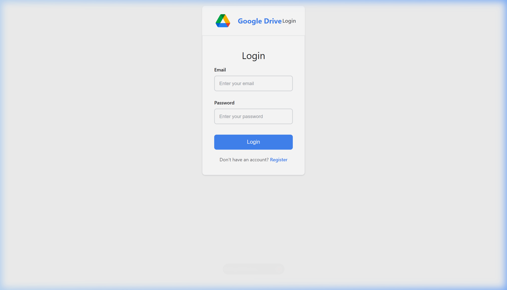
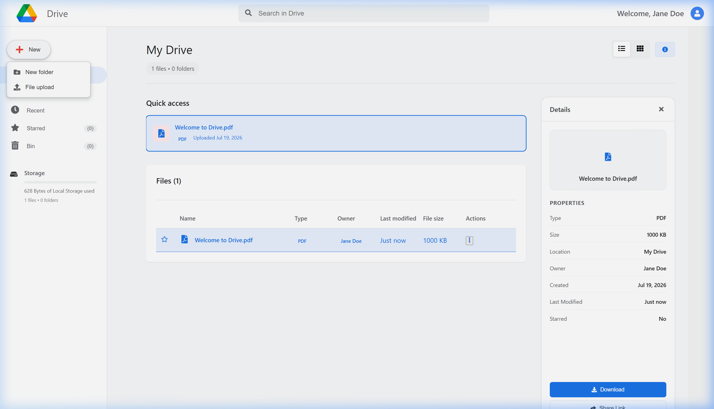
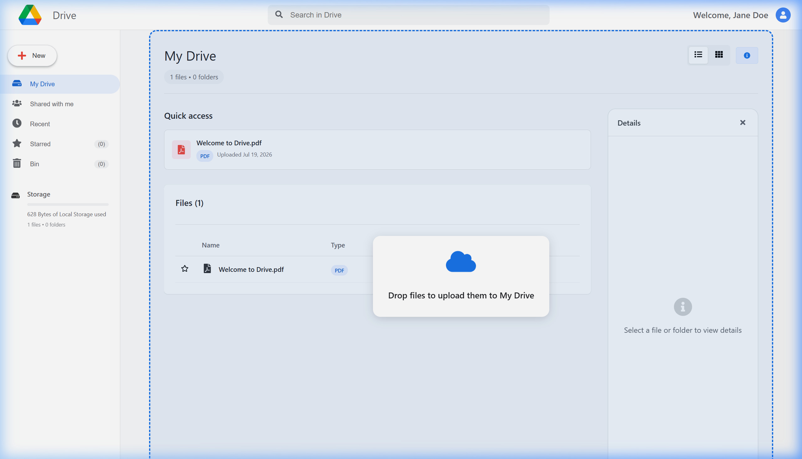

# Google Drive Clone (REP)

A full-stack cloud storage web application inspired by Google Drive, built using the **MERN stack**. The application allows users to securely upload, manage, and organize files through a modern and responsive web interface.

## 🚀 Features

* 🔐 JWT-based user authentication
* 📁 File upload and management
* 📂 View and organize uploaded files
* ⬇️ Download files securely
* 🗑️ Delete files
* 📱 Responsive UI for desktop and mobile
* ☁️ MongoDB-backed persistent storage

## 🛠️ Tech Stack

### Frontend

* React.js
* CSS / Tailwind / Bootstrap *(replace with what you used)*

### Backend

* Node.js
* Express.js

### Database

* MongoDB Atlas

### Authentication

* JSON Web Tokens (JWT)

## 📂 Project Structure

```bash
GoogleDriveClone/
│
├── client/          # React frontend
│   ├── src/
│   └── public/
│
├── server/          # Node.js + Express backend
│   ├── routes/
│   ├── models/
│   ├── controllers/
│   ├── middleware/
│   └── uploads/
│
├── README.md
└── package.json
```

## ⚙️ Installation & Setup

### 1. Clone the repository

```bash
git clone https://github.com/YOUR_USERNAME/google-drive-clone.git
cd google-drive-clone
```

### 2. Install dependencies

#### Backend

```bash
cd server
npm install
```

#### Frontend

```bash
cd ../client
npm install
```

### 3. Configure Environment Variables

Create a `.env` file inside the `server` directory.

```env
MONGO_URI=your_mongodb_connection_string
JWT_SECRET=your_secret_key
PORT=5000
```

Create a `.env` file inside the `client` directory *(if using Vite, use `VITE_API_URL` instead)*:

```env
REACT_APP_API_URL=http://localhost:5000
```

### 4. Run the application

#### Start Backend

```bash
cd server
npm start
```

#### Start Frontend

```bash
cd client
npm start
```

The application will be available at:

* Frontend: `http://localhost:3000`
* Backend: `http://localhost:5000`

## 📸 Screenshots

Add your screenshots here after deployment.

### Login Page



### Dashboard



### File Upload



## 🌐 Live Demo

* Frontend (Netlify): `https://your-netlify-link.netlify.app`
* Backend (Render): `https://your-render-link.onrender.com`

## 🎯 Learning Outcomes

This project helped in understanding:

* MERN stack architecture
* RESTful API development
* JWT authentication and authorization
* File upload handling
* MongoDB integration
* Frontend-backend communication
* Deployment using Netlify and Render

## 🔮 Future Enhancements

* Folder creation and hierarchy
* File sharing with other users
* Search and filter functionality
* Drag-and-drop uploads
* Cloud storage integration
* Dark / light theme toggle

## 👨‍💻 Author

**Sreemanth S**

* GitHub: https://github.com/Sreemanth11
* LinkedIn: https://linkedin.com/in/sreemanth11

## 📄 License

This project is developed for educational and portfolio purposes.
